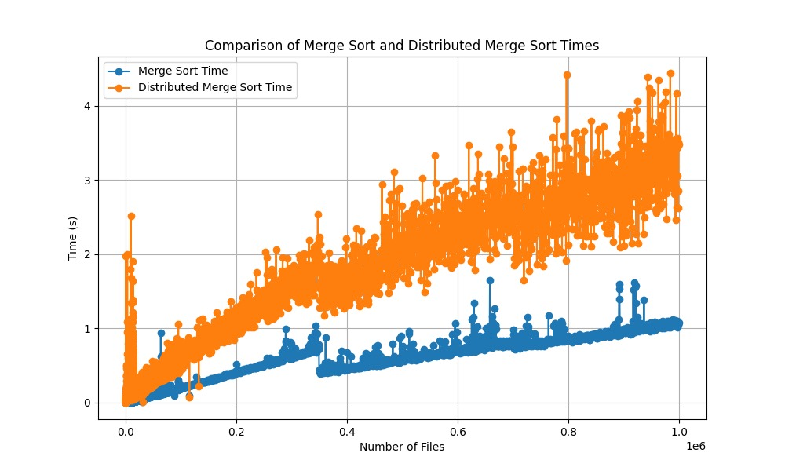
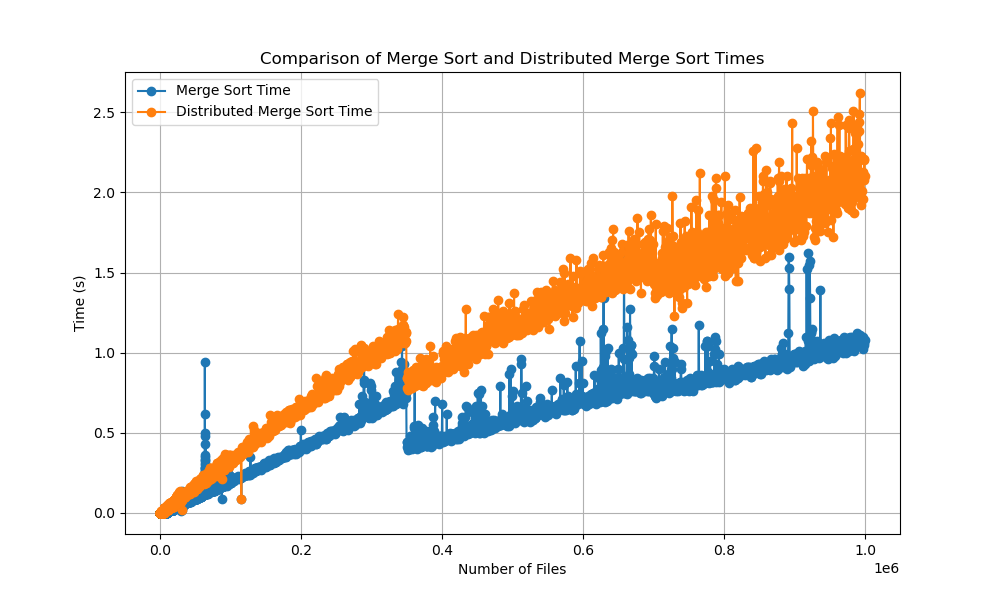
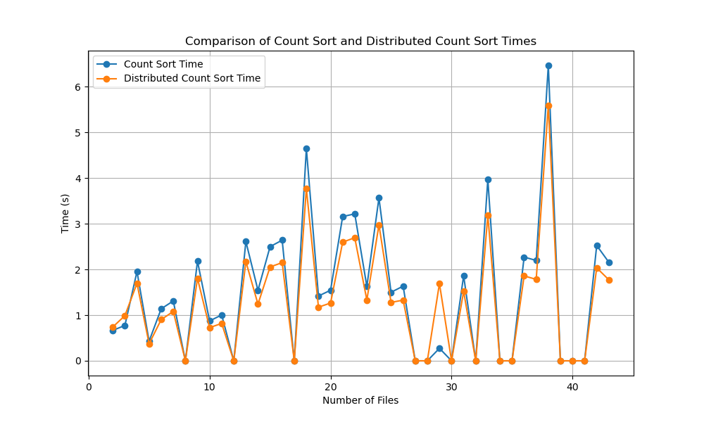
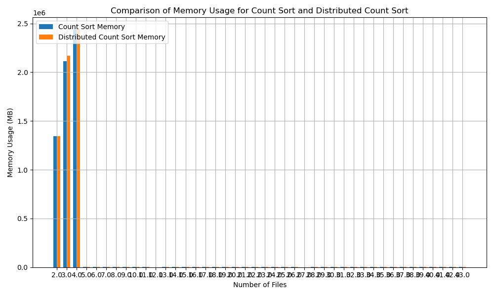
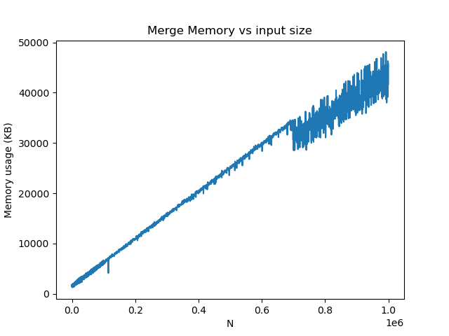
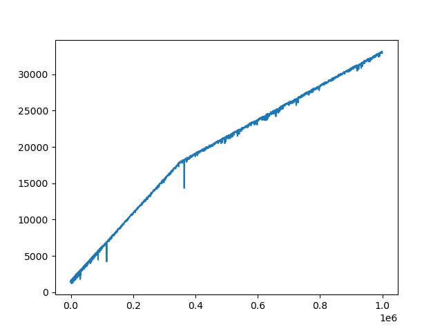
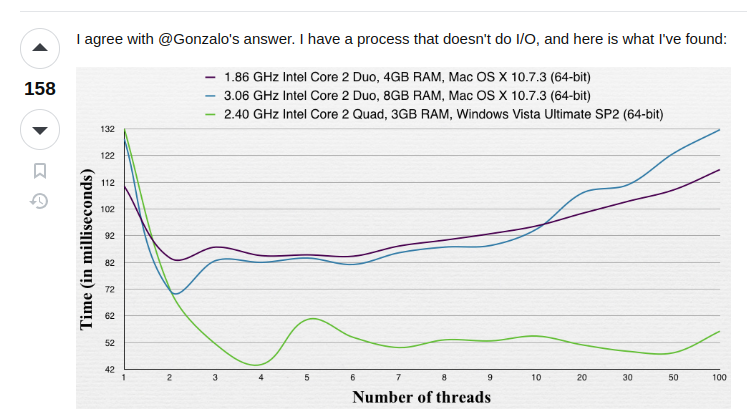
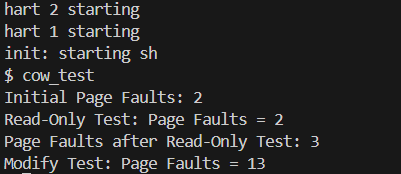

# LAZY™ Corp
OSN Monsoon 2024 mini project 3
### Team 87
Mrudani Pimpalkhare, Gautam Bhetanabhotla

<br>

# Report 

## Part 1 : Distributed Sorting System Performance

### Implementation Analysis : Merge Sort


The idea is that since for an array, we are sorting its left and right subarrays, why not have those 2 sorts on separate threads? There is no shared data between those arrays so locks aren't required either.

Approach 1: Naive
```
mergesort:
    mergesort left subarray on a new thread;
    mergesort right subarray on a new thread;
    join threads;
    merge;
```
However, the main thread is doing nothing until the new threads are joined back. Also, this creates a large number of threads, which is linear with respect to input size.

Approach 2:
```
mergesort:
    mergesort left subarray on a new thread;
    mergesort right subarray;
    join thread;
    merge;
```
This **halves** the number of threads being created and makes sure no thread remains idle. However, the number of threads being created is still large.

Approach 3: Limiting the number of threads
```
num_threads = 0;
max_threads = X;

mergesort:
    if num_threads <= max_threads:
        num_threads++;
        mergesort left subarray on a new thread;
        mergesort right subarray;
        join thread;
        num_threads--;
    else:
        mergesort left subarray;
        mergesort right subarray;
    merge;
```
Of course, a lock must be used to make sure there are no race conditions when it comes to modifying the `num_threads` variable.

There is no point of making multithreaded programs if all the threads run on the same proessor. It will not be faster than a single-threaded sequential program.

Turns out that this is exactly the method specified in https://rachitvasudeva.medium.com/parallel-merge-sort-algorithm-e8175ab60e7#da33. 
Since the recursion tree descends at the same rate at all nodes (because of the concurrency), the threading gets limited to a particular level in the tree.

On having `max_threads` set to 128, we obtained a runtime of roughly 4 times that of regular merge sort:



On setting it to 16, we got roughly 2.5 times the runtime of regular merge sort:





### Implementation Analysis : Count sort 

The initial idea was to assign chunks (mini-arrays) to each thread (limited to 16) and assign each array element to a chunk/thread, according to the range it lies in, w.r.t the maximum value. As a result, each thread has to run countsort independently, and once each thread is done with its work, the chunks can be simply merged into the final array. 
On further analysis we realised that given the input size, having threads won't make much a difference for this implementation. Additionally, this implementation was overcomplicated. 

We then decided have each thread iterate through a small part of the array and then update the count array. This required the implementation of locks. 

Implementing the count part was quite straightforward for sorting based on IDs and timestamps, but for names we used the following technique: 

Since there are 128^128 possible ASCII strings of length 128, there are way too many strings to do a count sort, as it will involve iterating through the entire search space.
We will limit the string length to 7 (a string of length 8 can also be hashed into an `unsigned long long int`, yes, but memory allocation for that huge of an array fails), and only allow lowercase English alphabets. This restricts the search space to 26^7 strings.

Also, directly allocating the count array of size 26^7 will prove inefficient at times. Let's say all strings start with an 'a', then all the non-zero elements in the count array are restricted to a small part of it. This problem can be somewhat fixed by dividing the count array into chunks and only allocating memory for a chunk when we find an element that belongs to that chunk. Implementation wise, this would mean creating an array of integer pointers. Allocate memory to each pointer if you find an element belonging to that chunk.

In our implementation, we allocate a 2D array of size 26 by 26^6. Use the first character to decide which of the 26 it goes to, and hash the rest to decide its position in the array. Therefore, this approach consumes an order of 26^6 bytes of memory at best and 26^7 at worst as compared to the naive approach which always takes up 26^7 bytes. We could go deeper by doing a 3D array but after a while it gets tedious to deal with so many levels of pointers as there is no convenient way to do it in C.

**Parallelising:**
Have each thread look at a different part of the array. For characteristics that are unique (like ID and name), no two threads will access the same element in the count array, so we need not use any locks.


### Execution Time Analysis: 
The actual data is logged in data.txt and data_dist.txt
Both contain 6 arrays in total, the two groups of three represent size, memory usage and time for  count sort and  mergesort(normal in data, distributed in data_dist) respectively. Here is an overview : 


1. Count sort 

```

No. of files : [2.0, 3.0, 4.0, 5.0, 14.0, 15.0, 16.0, 17.0, 40.0, 41.0, 42.0, 43.0]

Time Taken for normal: [0.66, 0.77, 1.95, 0.43, 1.54, 2.49, 2.64, 0.0, 6.46, 0.0, 0.0, 0.0]

Time Taken for distributed: [3.4879999999999995, 1.168, 0.41200000000000003, 0.26, 0.646, 1.078, 1.0959999999999999, 0.0, 0.0, 0.0, 0.0]

```


As the number of files increases, we a significant decrease in running time for distributed count sort 

2. Merge sort 

```

No. of files = [43, 44, 45, 46, 2748, 2749, 2750, 2751,10515, 10516, 10517, 10518]

Time for normal = [0.0, 0.0, 0.0, 0.0, 0.0, 0.0, 0.0, 0.0, 0.02, 0.02, 0.02, 0.02]

time for distributed = [0.17, 0.17, 0.17, 0.17, 0.17, 0.17, 0.17, 0.17, 0.17, 0.17, 0.17, 0.17]

```


### Memory Usage Overview:

1. count sort : 

```
No. of files : [2.0, 3.0, 4.0, 5.0, 14.0, 15.0, 16.0, 17.0, 40.0, 41.0, 42.0, 43.0]

Memory Usage for normal count sort: [1343948.8, 2116044.8, 2435635.2, 3609.6, 3204.8, 3440.8, 2880.0, 4013.6, 2457.6, 2406.4, 2304.0, 3302.4]

Memory Usage for distributed count sort: [1331639.2, 2166856.8, 1790.4, 4008.0, 3204.8, 3440.8, 2880.0, 4013.6, 4993.6, 2936.0, 5304.8]
```

Count Sort
- Normal Count Sort:

Small Datasets:
Memory usage is relatively low and scales linearly with the number of files. For example, with 43 files, the memory usage is 3302.4 KB.
Large Datasets:
Memory usage increases significantly with the number of files. For instance, with 10518 files, the memory usage is 4172.8 KB.

- Distributed Count Sort:

Small Datasets:
Memory usage is slightly higher compared to normal count sort due to the overhead of managing distributed processes. For example, with 43 files, the memory usage is 5304.8 KB.
Large Datasets:
Memory usage increases significantly and is higher than normal count sort. For instance, with 10518 files, the memory usage is 5886.4 KB. This is due to the additional memory required for inter-process communication and synchronization.

2. merge sort : 

```
No. of files = [43, 44, 45, 46, 2748, 2749, 2750, 2751,10515, 10516, 10517, 10518]

Memory for normal merge sort = [1536, 1408, 1536, 1408, 1408, 1408, 1408, 1536, 1920, 1920, 1920, 1920]

memory for distributed : [7228, 5188, 7220, 5308, 26012, 23716, 29920, 23888, 24460, 25184, 26648, 30712]

```

- Normal Merge Sort:

    Small Datasets:

    Memory usage is relatively low and consistent. For example, with 43 files, the memory usage is 1536 KB.
    Large Datasets:

    Memory usage remains consistent but increases slightly with larger datasets. For instance, with 10518 files, the memory usage is 1920 KB.


- Distributed Merge Sort:

    Small Datasets:

    Memory usage is significantly higher compared to normal merge sort due to the overhead of managing distributed processes. For example, with 43 files, the memory usage is 7228 KB.

    Large Datasets:

    Memory usage increases significantly and is much higher than normal merge sort. For instance, with 10518 files, the memory usage is 30712 KB. This is due to the additional memory required for inter-process communication, synchronization, and maintaining multiple copies of data across distributed nodes.

### Graphs: 

#### Count Sort 





#### Merge Sort 


**Distributed merge sort (memory)**



**Merge sort (memory)**



### Summary: 


1. Our approach for count sort using threads proved to be efficient for a larger file count (close to 30-40), this is because multiple chunks were being handled at once. 

2. Merge sort could be optimised with a different number of threads, because of the fact that having too many threads will cause an overhead in terms of context switches. Here's a graph found on stack overflow (at https://stackoverflow.com/questions/1718465/optimal-number-of-threads-per-core):


3. Reiterating the previous point, multithreaded algorithms *only perform better to the point where the overhead caused by context switches dominates the performance boost achieved by parallel processing.*


### Areas for optimisation : 

1. Finding the optimal number of threads<br>
    In our case, we had a lot of testcases (~ 34000 cases, took up 48GB of storage and 1.5 hours to run!) so we couldn't keep testing after varying the number of threads.


## Part 2: Copy on Write

Refer to cow_test.c in the users directory
maintained a static variable that counts the number of times page fauklt was triggered due to COW

1. ```main()``` : allocate memory in the parent process, shared with child process on forking
2. ```read_only_test()``` : only access the memory, doesnt read : no COW faults
3. ```write_only_test()``` : attempts to write, causes fault n times, where n is the number of pages allocated (10, in this case) 




## Implementation 

1. the ```fork()```implementation originally calls uvmcopy to copy the memory pages of the parent to the child (by first using memmove and then mappages)
2. We modify ```uvmcopy()``` to first update the flags, and then instead of creating a new copy, we map the memory pages of the new process such that both pages share the same address.
3. We also maintain a reference count array for each page, to track how many processes refer to a page, to avoid erroneous freeing of pages. 
4. Now, the usertrap function handles an extra trap that is caused by a page fault (```r_scause()==15```). The cow_handler() ensures that the fault was indeed caused due to an attempt to write to a read-only page. If so, the flags are updated, and finally a copy of the page is made, the process' memory pages are unmapped from the original physical address, and is mapped to a new one with the updated flags. 
5. Additionally the TLB is flushed so that writes do not occur to the faulting address. (```sfence_vma()```)
6. This page fault also has to be checked when data from the kernel space is copied to the user space. This is implemented in ```copyout().```

## Brief Analysis


### Benefits of COW Fork
- **Efficiency**: The COW fork mechanism allows processes to share memory pages until a write operation occurs, reducing the overhead of copying memory pages during the fork operation.
- **Memory Conservation**: By sharing memory pages between parent and child processes, COW fork significantly reduces memory usage, especially for processes that do not modify memory.

### Areas for Optimization
- **Page Fault Handling**: The current implementation of COW may introduce overhead due to frequent page faults when memory is modified. Optimizing the page fault handler to reduce latency can improve performance.

