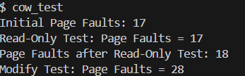

# xv6

# Copy on Write (COW) Fork Report

## Page Fault Frequency



## Implementation 

1. the ```fork()```implementation originally calls uvmcopy to copy the memory pages of the parent to the child (by first using memmove and then mappages)
2. We modify ```uvmcopy()``` to first update the flags, and then instead of creating a new copy, we map the memory pages of the new process such that both pages share the same address.
3. We also maintain a reference count array for each page, to track how many processes refer to a page, to avoid erroneous freeing of pages. 
4. Now, the usertrap function handles an extra trap that is caused by a page fault (```r_scause()==15```). The cow_handler() ensures that the fault was indeed caused due to an attempt to write to a read-only page. If so, the flags are updated, and finally a copy of the page is made, the process' memory pages are unmapped from the original physical address, and is mapped to a new one with the updated flags. 
5. Additionally the TLB is flushed so that writes do not occur to the faulting address. (```sfence_vma()```)
6. This page fault also has to be checked when data from the kernel space is copied to the user space. This is implemented in ```copyout().```


## Brief Analysis

### Benefits of COW Fork
- **Efficiency**: The COW fork mechanism allows processes to share memory pages until a write operation occurs, reducing the overhead of copying memory pages during the fork operation.
- **Memory Conservation**: By sharing memory pages between parent and child processes, COW fork significantly reduces memory usage, especially for processes that do not modify memory.

### Areas for Optimization
- **Page Fault Handling**: The current implementation of COW may introduce overhead due to frequent page faults when memory is modified. Optimizing the page fault handler to reduce latency can improve performance.
- **Memory Allocation**: Efficiently managing the allocation and deallocation of memory pages can further optimize the COW mechanism. Techniques such as batching memory operations or using more sophisticated memory allocators can be explored.