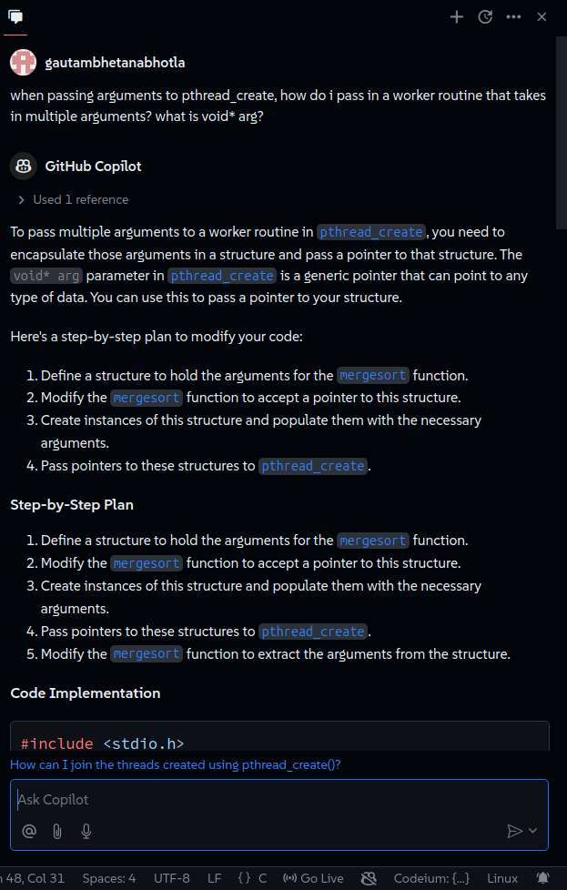
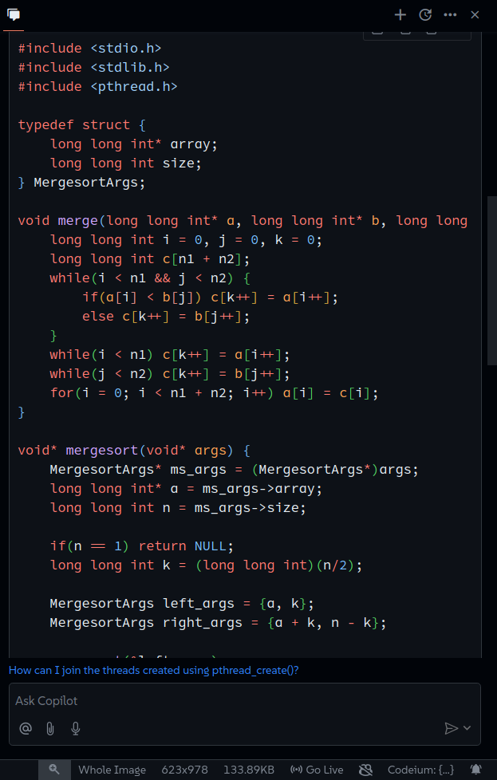
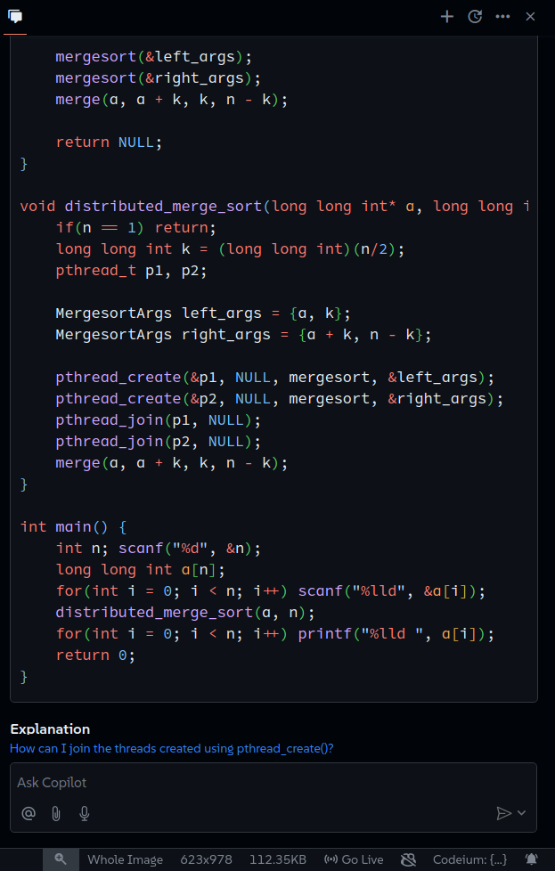
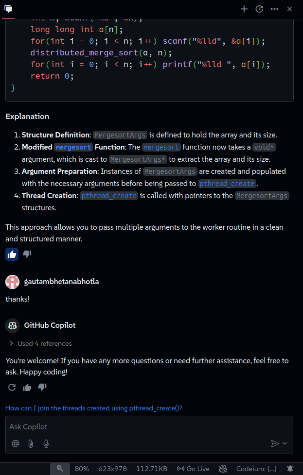
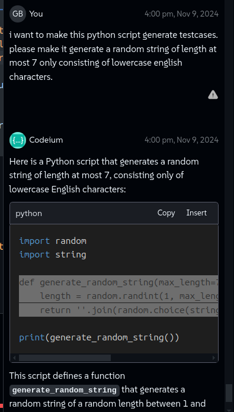
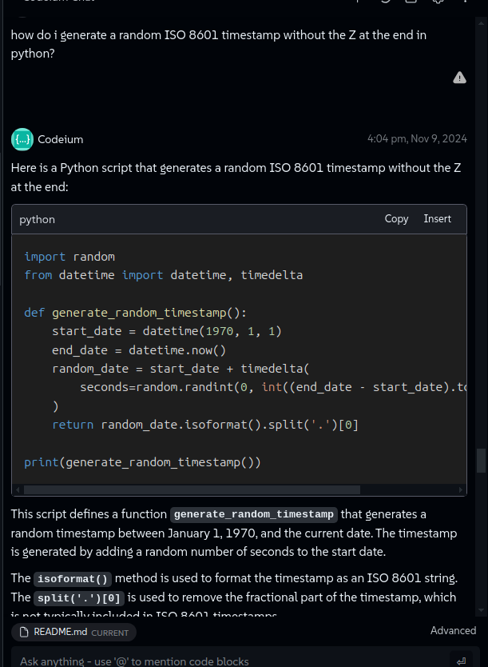
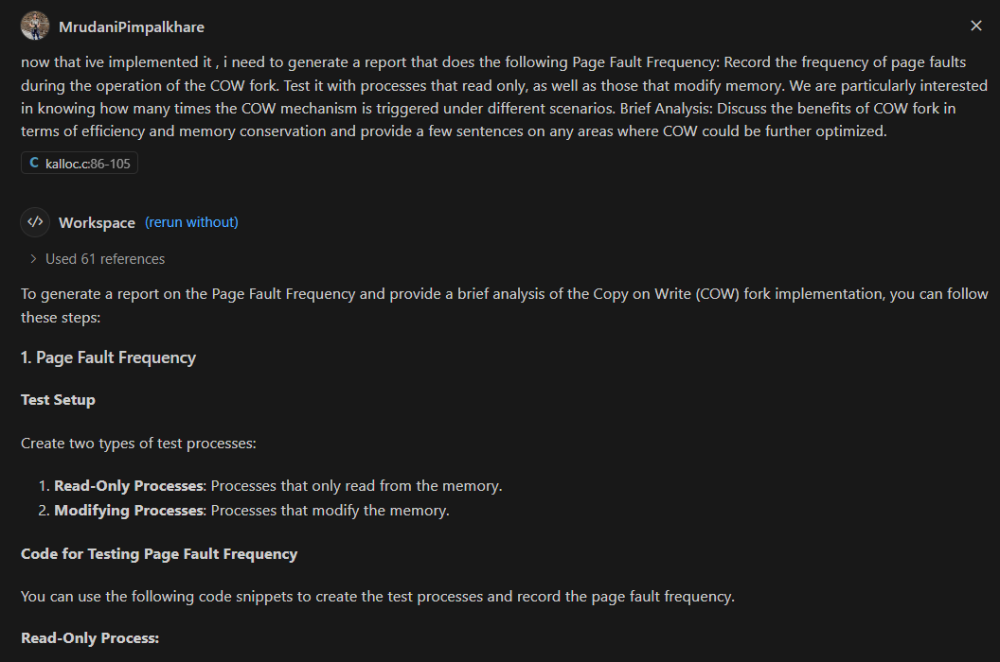
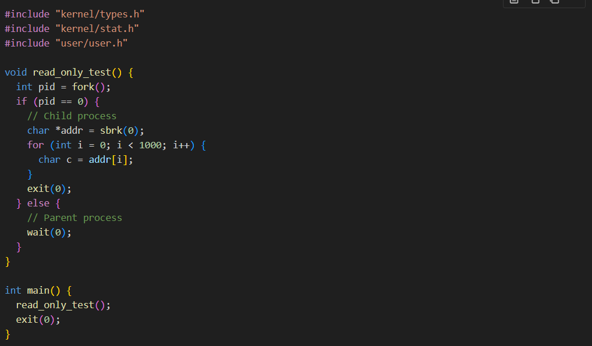
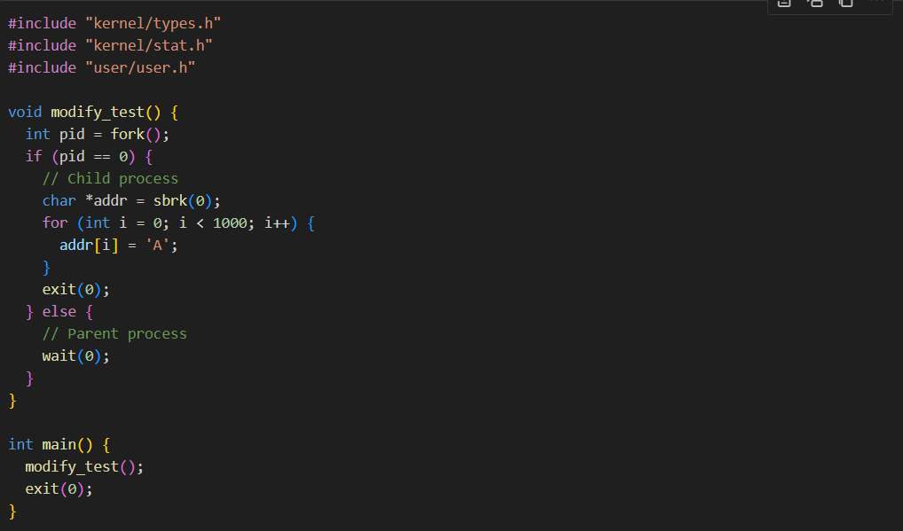
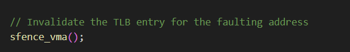

## Prompt 1
Asking how to pass a worker routine that takes in multiple arguments to `pthread_create()`.

## Prompt 2
Creating testcases for LAZY Sort using a python file

## Prompt 3 
Generating a file for the report 
 
 
 
 

## Prompt 4 
Generating code for countsort for IDs 
